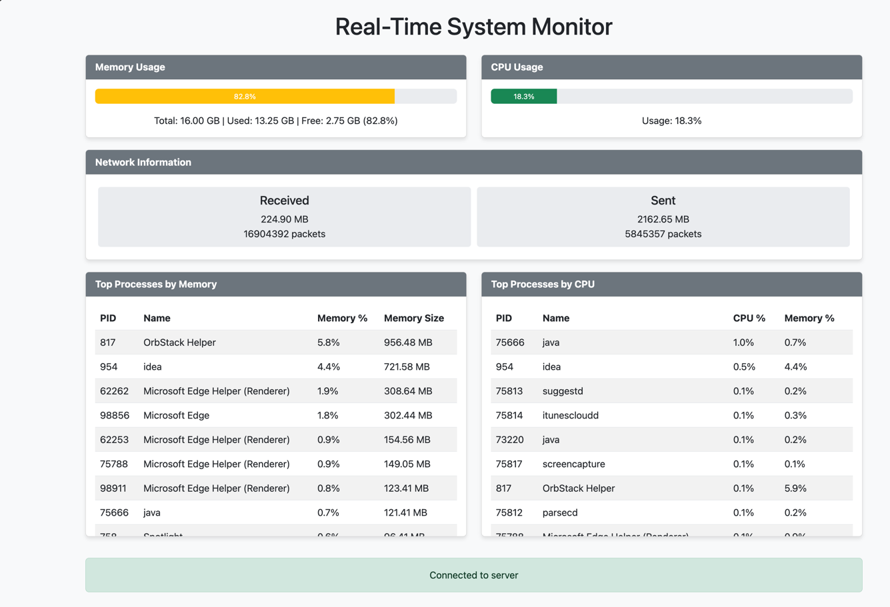

# real-time-system-monitor
A system monitoring application written in Java using Spring Boot. Displays CPU, memory, network stats, and top processes through a web interface using WebSockets for real-time updates.

## Features
- CPU usage monitoring with progress bar
- Memory usage statistics with progress bar
- Network traffic information (bytes and packets)
- Top processes by CPU and memory usage
- Real-time web interface with WebSocket updates
- Color-coded indicators for resource usage levels

## Technologies
- Java 17
- [Spring Boot](https://spring.io/projects/spring-boot) for application framework
- [Spring WebSocket](https://docs.spring.io/spring-framework/reference/web/websocket.html) for real-time communication
- [OSHI](https://github.com/oshi/oshi) (Operating System and Hardware Information) for system monitoring
- [Bootstrap](https://getbootstrap.com/) for responsive web UI
- [SockJS](https://github.com/sockjs/sockjs-client) and [STOMP](https://stomp-js.github.io/) for WebSocket client

## Building and Running
This project uses Maven for dependency management and building.

### Prerequisites
- Java 17 or higher
- Maven

### Build
```bash
mvn clean package
```

This will create an executable JAR file in the `target` directory.

### Run
```bash
java -jar target/real-time-system-monitor-1.0-SNAPSHOT.jar
```

### Accessing the Web UI
Once the application is running, you can access the web UI by opening a web browser and navigating to:

```
http://localhost:8080
```

The web UI provides real-time monitoring of:
- CPU usage with color-coded progress bar
- Memory usage with color-coded progress bar
- Network traffic information (bytes and packets sent/received)
- Top processes by memory usage
- Top processes by CPU usage

All data is updated in real-time via WebSocket connection, with no need to refresh the page.

## Web UI Features

### Real-Time Updates
The web UI uses WebSockets to receive real-time updates from the server. This means that all data is updated automatically without needing to refresh the page.

### Color-Coded Indicators
The progress bars for CPU and memory usage are color-coded to indicate the severity of resource usage:
- Green: Low usage (0-70%)
- Yellow: Medium usage (70-90%)
- Red: High usage (90-100%)

### Responsive Design
The web UI is built with Bootstrap and is fully responsive, working well on desktop and mobile devices.

### Automatic Reconnection
If the WebSocket connection is lost, the UI will automatically attempt to reconnect to the server.


